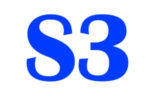

# Mau Sembuh Itu Mudah - Platform Penyembuhan Holistik S3

  

### **S3 - Sembah Sentuh Sembuh**
#### *Mau Sembuh Itu Mudah dengan Penyembuhan Spiritual & Doa*

## 🌟 Tentang Kami

**Mau Sembuh Itu Mudah** adalah platform penyembuhan holistik yang berfokus pada penyembuhan spiritual melalui **S3 (Sembah-Sentuh-Sembuh)**. Kami percaya bahwa kesembuhan sejati datang dari keseimbangan mental, sosial, dan spiritual.

> *"Hati yang gembira adalah obat yang manjur, tetapi semangat yang patah mengeringkan tulang."* - Amsal 17:22

## 🎯 Misi Kami

Misi utama kami adalah membangun dan menguatkan individu maupun kelompok untuk mencapai keseimbangan:
- ✨ **Mental** - Ketenangan pikiran
- 🤝 **Sosial** - Hubungan yang harmonis  
- 🙏 **Spiritual** - Kedekatan dengan Tuhan

## 🏥 Layanan Penyembuhan

### ✅ Penyembuhan Kolektif
Kami menyediakan **pelayanan kolektif (ramai orang)** karena percaya kesembuhan lebih bermakna dalam komunitas yang saling mendukung.

### 🙌 Metode Penyembuhan
- **Penyembuhan melalui doa dan iman**
- **Sentuhan spiritual** 
- **Penyembuhan holistik tanpa obat kimia**
- **Pelayanan di berbagai wilayah Indonesia**

## 📖 Dokumentasi Kesembuhan

### 🎗️ Testimoni Nyata
Kami telah membantu puluhan orang dengan berbagai kondisi:
- **Saraf kejepit** selama 3 tahun - sembuh total
- **Orang lumpuh** berjalan kembali
- **Sesak nafas & pendengaran** - pulih sempurna
- **Penyakit kronis** - sembuh melalui iman

### 📸 Galeri Kesembuhan
- [Kekuatan Doa](article-1.html) - Dokumentasi penyembuhan saraf kejepit
- [Orang Lumpuh Berjalan](article-2.html) - Mukjizat penyembuhan total
- [Pelayanan di Kalimantan](article-3.html) - Melayani masyarakat pedalaman
- [Iman Menyelamatkan](article-5.html) - Kisah nyata kesembuhan melalui iman

## 🌍 Lokasi Pelayanan

Kami aktif melayani di berbagai wilayah:
- 🏝️ **Kalimantan Barat** - Desa-desa terpencil
- 🌆 **Jawa** - Wilayah perkotaan
- 🏔️ **Sulawesi** - Komunitas pedalaman
- 📍 **Seluruh Indonesia** - Melayani dimana saja dibutuhkan

## 📞 Kontak & Konsultasi

Untuk layanan penyembuhan dan konsultasi spiritual:

### 📱 WhatsApp
[Hubungi via WhatsApp](https://wa.me/6281234567890) - **Fast Response**

### 📧 Email
s3sembahsentuhsembuh@gmail.com

### 📍 Alamat
Jl. Penyembuhan No. 123, Kota Harapan, Indonesia

## 🚀 Cara Mendapatkan Penyembuhan

1. **Hubungi kami** via WhatsApp
2. **Ceritakan kondisi** Anda atau keluarga
3. **Jadwalkan sesi** penyembuhan
4. **Ikuti proses** penyembuhan spiritual
5. **Saksikan mukjizat** kesembuhan

## 🎯 Keyword Utama
- **Mau sembuh itu mudah**
- **Penyembuhan spiritual**
- **Penyembuhan melalui doa**
- **S3 Sembah Sentuh Sembuh**
- **Penyembuhan kolektif**
- **Penyembuhan holistik Indonesia**

## 🔗 Sosial Media

Follow kami untuk update kesembuhan terbaru:
- 📘 [Facebook](https://facebook.com/s3sembahsentuhsembuh)
- 🐦 [Twitter](https://twitter.com/s3sembuh)
- 📸 [Instagram](https://instagram.com/s3sembahsentuhsembuh)

## 📄 Lisensi

Proyek ini dilisensikan di bawah [MIT License](LICENSE) - lihat file [LICENSE](LICENSE) untuk detail.

---

  
### **Mau Sembuh Itu Mudah - Bersama S3, Kesembuhan Ada di Tangan Anda**
  
*#MauSembuhItuMudah #S3SembahSentuhSembuh #PenyembuhanSpiritual #PenyembuhanHolistik*

